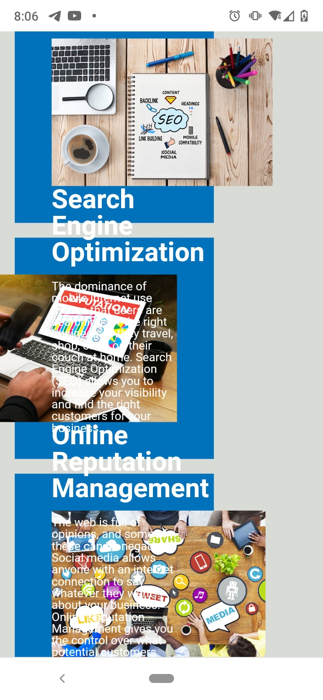
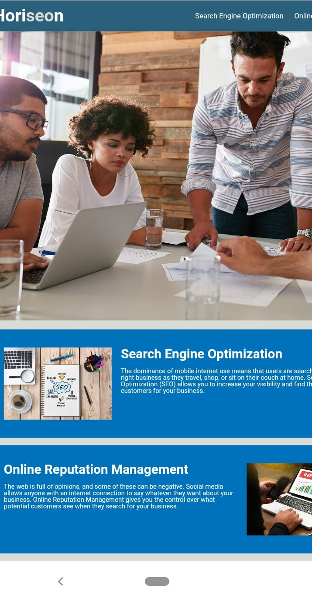

# Comments on Refactored Code

Please see below for a description of the changes made to the code and see the following deployed page https://languagebytes.github.io/Horiseon-Social-Solution-Services/ .

## Semantic HTML elements and SEO

 In order to make the webpage more informative and adaptable, I have substituted div elements for semantic elements, e.g nav, section, article, figure, and aside, where possible in the HTML file. This should improve its readability for other developers and enhance SEO by allowing browsers and search engines to better interpret its content. To improve SEO, I added in a meta description tag which will appear when the website is featured in search results or sent as a link. I chose to display the name of the organisation for the title to be consistent with the rest of the site.

## Adding Comments  

To provide clarity for other developers accessing the code, I added comments to the HTML and CSS files and rearranged the structure in order of appearance on the site. Originally, the class for the cover image had a class name called 'hero', I changed this to 'services'.

## Alt Text and Accessibility

 To meet accessibility standards, I added alt text to the images. I tried to be descriptive whilst keeping under 125 characters. Adding details about the image could provide a richer, more inclusive experience for those with visual impairments using screen readers. 

## Checking Links 

The first link "Search Engine Optimisation" was missing an id. I added an id so that when clicked it should direct the user to the section in the article about SEO. 

## An attempt... :) at Responsive Design

I added in a reset.css file to try to counteract any default formatting in the browser. In order to try and make sure that the website would fit all browsers I added in a meta viewport tag in the head section and attempted :) to add media queries to the CSS. In theory, this should have helped prevent the formating from becoming corrupted on smaller screens. However, I did not succeed this time with flexbox, unfortunately :). Instead, at the moment, the smaller devices will show a full but zoomable full screen (see phone screenshots below) as opposed to the original which had the text and pictures overlapping. If I were to spend more time on this task I would focus on this aspect so that the smaller screens had a column design instead of a row design.

Before 

After 

## Thoughts and Questions about Task

Overall, I found this task very useful and I have learnt a lot about structuring pages, SEO and accessibility standards in the process. I am still not confident about the standards SEO and accessibility, and so I would like to do further research into this after completing this task. Although adding details about the image in the alt text can provide a richer experience for those visual impairments, on the other hand, I read that alt text needs to be quite concise, how descriptive is too descriptive when it comes to alt text? Should a header tag also be used for the h2/h3 tags? How should we best describe icon images, do we need to provide a physical description of the icons or display the text of the heading they correlate to? How would flexbox be achieved without the text and pictures overlapping eachother on smaller screens - would the page need to be split into cards? Thank you :). 

